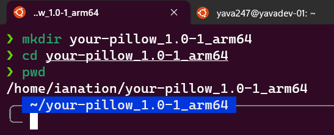
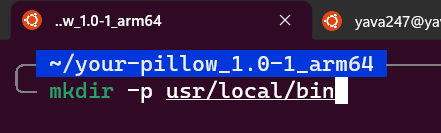
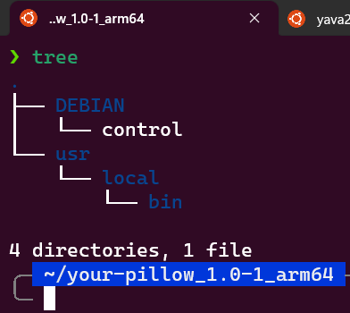
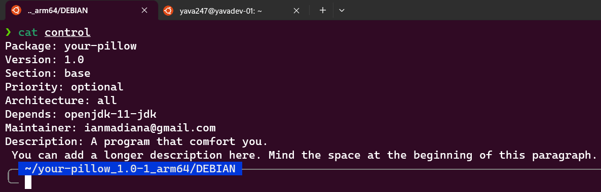
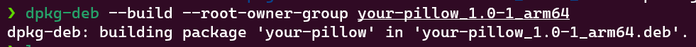
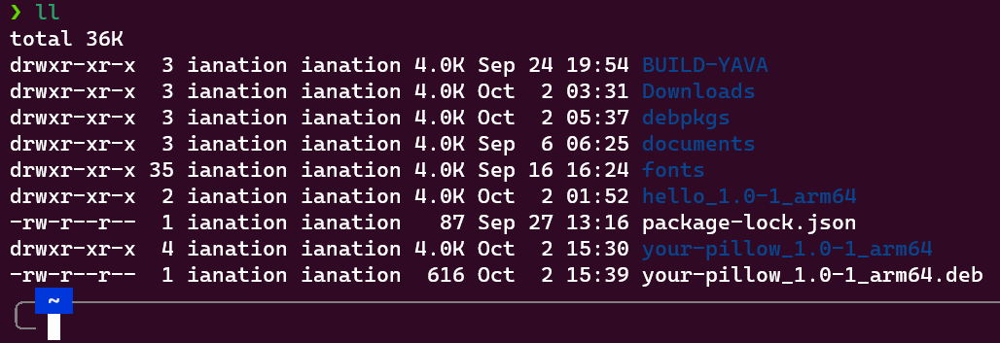
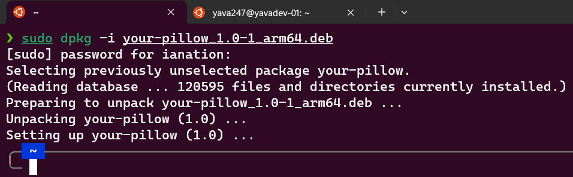
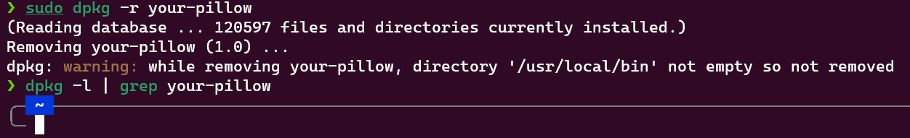

# How to create binary source

File `.deb` adalah format paket yang digunakan dalam sistem operasi berbasis Debian, seperti Debian sendiri, Ubuntu, dan turunannya. Paket `.deb` berisi perangkat lunak, aplikasi, atau library bersama dengan informasi pengelolaan paket yang digunakan oleh manajer paket Debian, seperti `dpkg` dan `apt`. Ini adalah cara standar untuk mendistribusikan dan menginstal perangkat lunak pada distribusi Linux berbasis Debian.

Dengan menggunakan paket .deb, user dapat dengan mudah menginstal, menghapus, dan mengelola perangkat lunak pada sistem Debian berbasis Linux. Manajer paket seperti dpkg dan apt akan memproses paket-paket ini, memastikan bahwa dependensi dipenuhi dan memastikan instalasi dan pemeliharaan perangkat lunak berjalan dengan baik.

Selain paket `.deb`, distribusi Linux lainnya memiliki format paket yang berbeda. Misalnya, distribusi berbasis Red Hat menggunakan paket RPM (Red Hat Package Manager). Masing-masing format paket memiliki alat dan metode manajemen paket yang berbeda, tetapi tujuan umumnya sama, yaitu menyediakan cara yang mudah untuk menginstal, mengelola, dan menghapus perangkat lunak pada sistem Linux.

## Membuat pake deb

### Langkah 1 - membuat working directory

Buat direktori baru dengan nama proyek yang akan dibuat:
```sh
your-pillow_1.0-1_arm64
```



### Langkah 2 - membuat struktur internal

Simpan program ke sistem target, contohnya program akan disimpan di direktori `/usr/local/bin`:
```sh
mkdir -p your-pillow_1.0-1_arm64/usr/local/bin
```


### Langkah 3 - membuat file control

```sh
mkdir DEBIAN

touch control
```

Struktur direktori:

### Langkah 4 - isi file control



### Langkah 5 - mulai membangun paket debian

Gunakan perintah berikut untuk membangun paket debian:
```sh
dpkg-deb --build --root-owner-group
```



Hasil output:



### Langkah 6 - tes paket debian

Install paket:
```sh
sudo dpkg -i your-pillow_1.0-1_arm64.deb
```



Hapus paket debian yang terinstall:

```sh
sudo dpkg -r your-pillow

# hapus dengan file konfigurasi
sudo dpkg -P your-pillow
```

