# How to create debian package using dpkg-deb

## Membuat paket

### Langkah 1

Membuat direktori dengan nama paket yang akan kita buat.

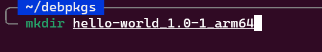

Nama folder untuk paket yang akan dibangun adalah sesuai dengan format `<name>_<version>-<revision>_<architecture>.deb`

Buat direktori bernama `DEBIAN` di dalam direktori projek:

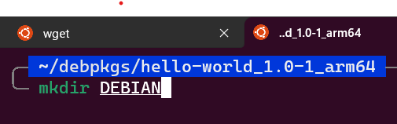

Buat file bernama `control` tanpa ekstensi apapun di diretori `DEBIAN`:

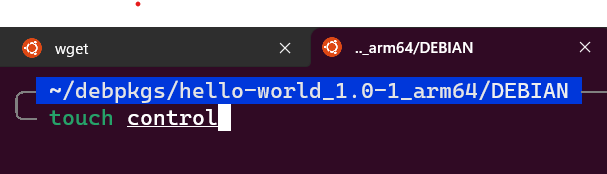

Sehingga strukur direktori projek menjadi sebagai berikut:

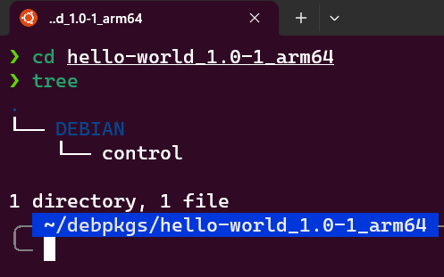
### Langkah 2

Isi file `control` dengan metadata berikut:

```
Package: hello-world
Version: 1.0 
Section: base 
Priority: optional 
Architecture: all 
Depends: openjdk-11-jdk 
Maintainer: ianmadiana@gmail.com 
Description: run jenkins.war as a service.
```

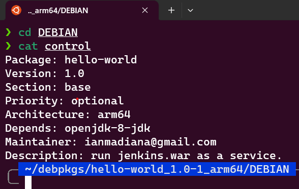

### Langkah 3

Download program jenkins.war yang akan digunakan sebagai service:

```sh
wget http://mirrors.jenkins.io/war/latest/jenkins.war
```

Buat direktori baru `opt/jenkins` dan masukkan file `jenkins.war` ke direktori `jenkins` sehingga struktur direktori menjadi seperti berikut:

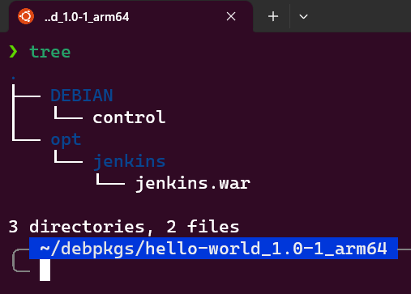

### Langkah 4

Buat direktori baru `etc/systemd/system` di dalam direktori projek:

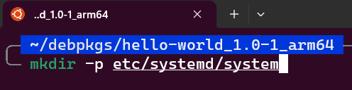

Buat file untuk menjalankan servis systemd bernama `jenkins.service` di direktori `system`:

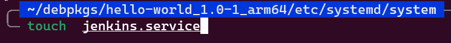

Isi dari file `jenkins.service`:
```sh
 [Unit]
 Description=Jenkins Daemon service
 [Service]
 ExecStart=/usr/bin/java -jar /opt/jenkins/jenkins.war --logfile=/var/log/jenkins.log
 SuccessExitStatus=143
 User=ianation
 [Install]
 WantedBy=multi-user.target
 ```
### Langkah 5

Buat direktori `var/log/` untuk menyimpan logging:

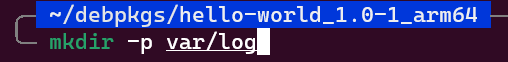

Buat file bernama `jenkins.log`:

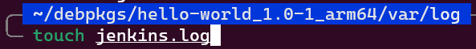

Sehingga struktur direktori keseluruhan menjadi seperti berikut:

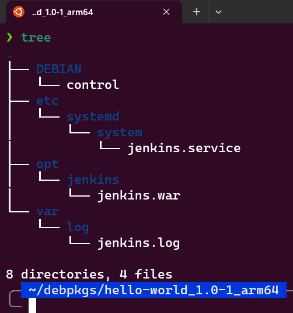

### Langkah 6

Membuat paket debian menggunakan perintah:
```sh
dpkg-deb --build hello-world_1.0-1_arm64
```

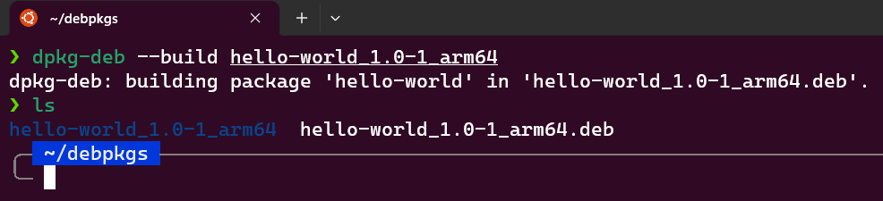

### Langkah 7

Install paket debian menggunakan perintah:
```sh
sudo dpkg -i hello-world_1.0-1_arm64.deb
```


Cek status jenkins:
```
sudo systemctl status jenkins
```

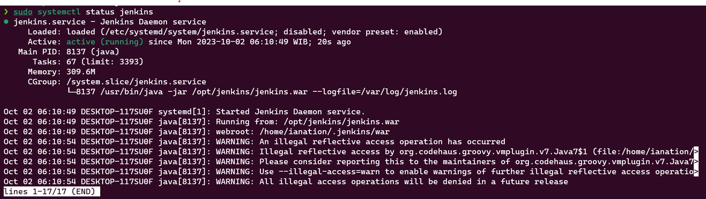

### Langkah 8

Menghapus aplikasi menggunakan perintah:
```sh
sudo dpkg --remove hello-world
```

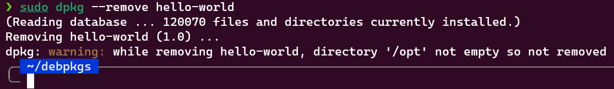
