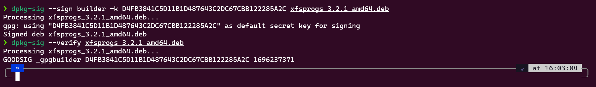

# How to assign key on debian package

Di Debian atau sistem operasi berbasis Debian seperti Ubuntu, "assign key" mengacu pada proses verifikasi dan pengesahan paket .deb yang diunduh atau diinstal pada sistem. Ini berkaitan dengan sistem tanda tangan digital yang digunakan untuk memastikan bahwa paket tersebut berasal dari sumber yang terpercaya dan tidak dimodifikasi secara tidak sah.

Proses assign key pada paket Debian melibatkan penggunaan kunci (key) tanda tangan digital yang digunakan oleh pengembang perangkat lunak atau penyedia paket untuk menandatangani paket-paket yang dibangun. Kunci ini digunakan untuk membuktikan bahwa paket tersebut benar-benar berasal dari sumber yang dapat dipercaya dan tidak dimodifikasi selama proses distribusi.

## Generate GPG Key Pair

```sh
gpg --gen-key
```

Buat user ID untuk mengidentikasi kunci:


## Cek daftar kunci yang sudah dibuat

```sh
gpg --list-keys
```


> Key yang didapatkan adalah : D4FB3841C5D11B1D487643C2DC67CBB122285A2C

## Memberikan signature pada paket deb

```sh
dpkg-sig --sign builder -k <gpg_key> <nama_paket.deb>
```

Contoh perintah untuk memberikan signature ke paket bernama `xfsprogs_3.2.1_amd64.deb`:

```sh
dpkg-sig --sign builder -k D4FB3841C5D11B1D487643C2DC67CBB122285A2C xfsprogs_3.2.1_amd64.deb
```

## Verifikasi signature

Verifikasi signature pada paket debian:

```sh
dpkg-sig --verify xfsprogs_3.2.1_amd64.deb
```

