# Testing HBase and Phoenix

## Create table to default namespace

Membuat table default di Phoenix:

```
CREATE TABLE "my_table" (
    id INTEGER PRIMARY KEY,
    name VARCHAR
);
```

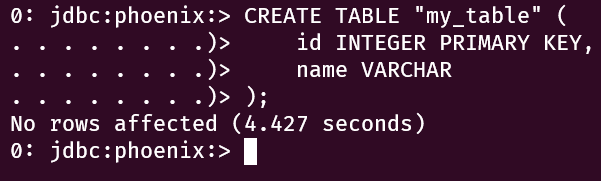

>Phoenix akan menggunakan skema/namespace default yang dikenal sebagai "DEFAULT". Jadi, jika tidak menyertakan skema saat membuat tabel, Phoenix akan mengasumsikan skema default.

Cek list table yang tersedia:

```
!tables
```

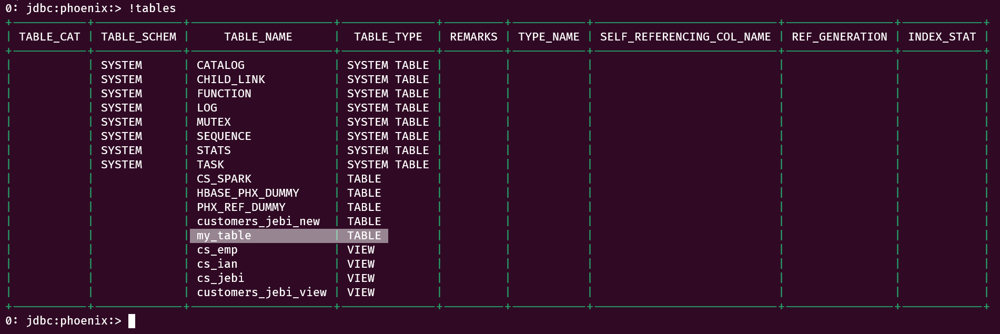

Table yang dibuat di `Phoenix` juga tersedia di `HBase`:

```
list
```

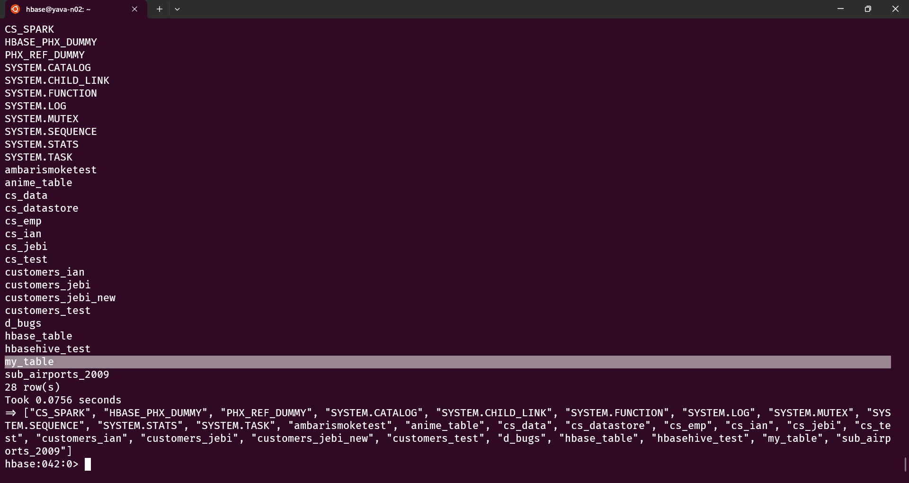

## Insert data to table using column family and column

Berikut adalah cara membuat table yang mempunyai column family di Phoenix:

1. Buat table seperti berikut:
   
   ```
   CREATE TABLE cs_ian (
        "customerNumber" VARCHAR PRIMARY KEY,
        "customer_data"."customerName" VARCHAR,
        "customer_data"."contactLastName" VARCHAR,
        "customer_data"."contactFirstName" VARCHAR,
        "customer_data"."phone" VARCHAR,
        "customer_address"."addressLine1" VARCHAR,
        "customer_address"."addressLine2" VARCHAR,
        "customer_address"."city" VARCHAR,
        "customer_address"."state" VARCHAR,
        "customer_address"."postalCode" VARCHAR,
        "customer_address"."country" VARCHAR,
        "transactions"."salesRepEmployeeNumber" VARCHAR,
        "transactions"."creditLimit" VARCHAR
    );
   ```

   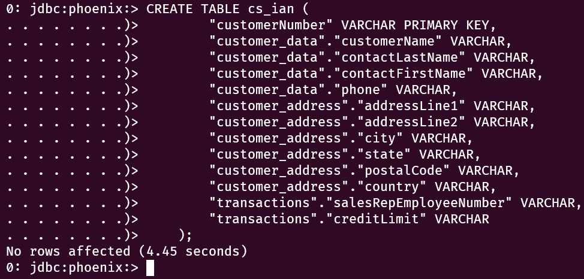

2. Masukkan data kedalam table yang telah dibuat:

    ```
    UPSERT INTO cs_ian VALUES (
        '103',
        'Atelier graphique',
        'Schmitt',
        'Carine',
        '40.32.2555',
        '54, rue Royale',
        NULL,
        'Nantes',
        NULL,
        '440000',
        'France',
        '1370',
        '210000'
    );
    ```

    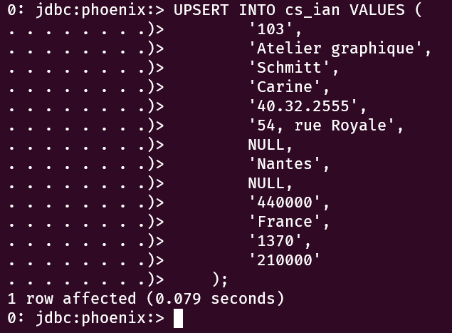

3. Cek table dan data didalamnya:
   
   ```
   !tables
   ```

   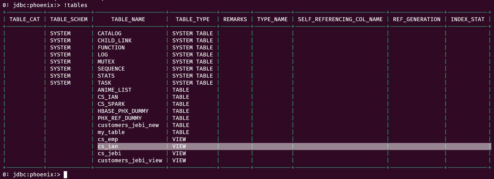

   ```
   SELECT * FROM cs_ian;
   ```

   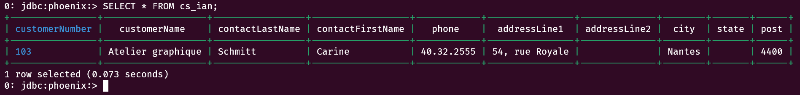

4. Cek table dan data di HBase:

    ```
    list
    ```

    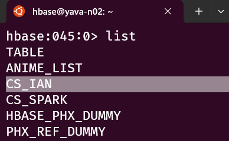

    ```
    scan 'CS_IAN'
    ```

    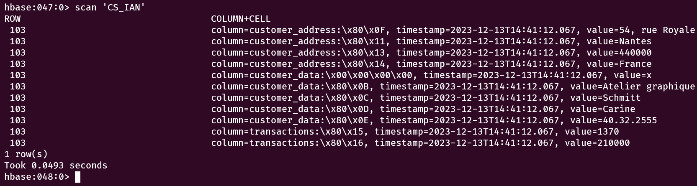


## Create table and insert data HBase from phoenix

Berikut ini adalah cara untuk membuat table di Phoenix:

```
CREATE TABLE anime_list (
    id INTEGER PRIMARY KEY,
    name VARCHAR,
    genre VARCHAR,
    rating DOUBLE
);
```

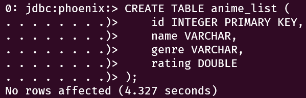


Cek apakah table berhasil dibuat dengan me-listing table di Phoenix:

```
!tables
```

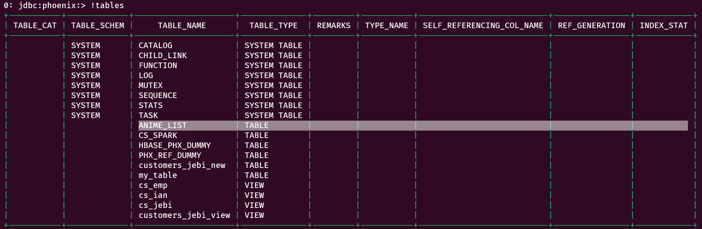

Insert data ke table:

```
UPSERT INTO ANIME_LIST VALUES (
    1,
    'Sousou no Frieren',
    ' Adventure, Drama, Fantasy',
    9.13
);
```

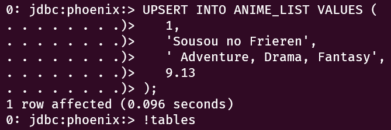

Menampilkan data dari table yang telah dibuat:

```
SELECT * FROM ANIME_LIST;
```

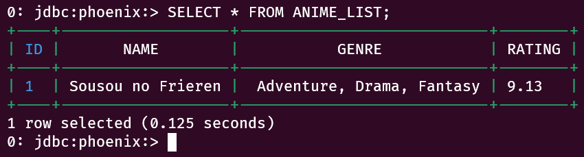

Table Phoenix terintegrasi dengan HBase sehingga table yang telah dibuat sebelumnya bisa dibaca melalui HBase:

```
scan '<nama_tabel>'
```

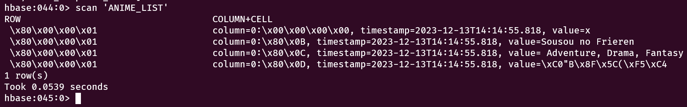