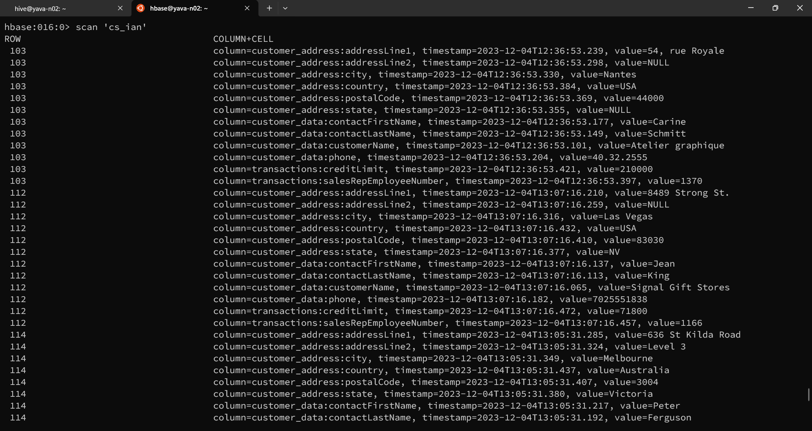
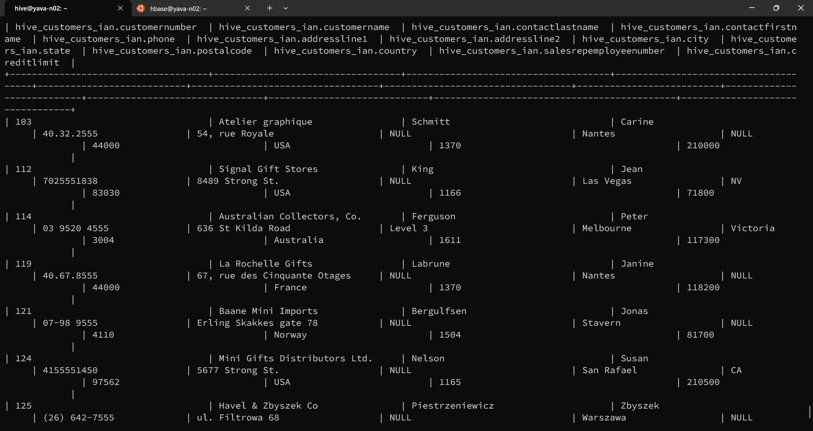

# Hive and HBase Integrations

## Menyiapkan data di HBase
Buat table untuk menampung data yang akan dimasukkan dengan perintah berikut:

```
# create 'cs_ian', 'customer_data', 'customer_address', 'transactions'
```

Masukkan contoh data dengan perintah `put`:
```
# put 'cs_ian','103','customer_data:customerName','Atelier graphique'
# put 'cs_ian','103','customer_data:contactLastName','Schmitt'
# put 'cs_ian','103','customer_data:contactFirstName','Carine'
# put 'cs_ian','103','customer_data:phone','40.32.2555'

# put 'cs_ian','103','customer_address:addressLine1','54, rue Royale'
# put 'cs_ian','103','customer_address:addressLine2','NULL'
# put 'cs_ian','103','customer_address:city','Nantes'
# put 'cs_ian','103','customer_address:state','NULL'
# put 'cs_ian','103','customer_address:postalCode','440000'
# put 'cs_ian','103','customer_address:country','France'
 
# put 'cs_ian','103','transactions:salesRepEmployeeNumber','1370'
# put 'cs_ian','103','transactions:creditLimit','210000'
```



## Buat table di Hive untuk integrasi dengan HBase


```
CREATE EXTERNAL TABLE IF NOT EXISTS hive_customers_ian (
  customerNumber STRING,
  customerName STRING,
  contactLastName STRING,
  contactFirstName STRING,
  phone STRING,
  addressLine1 STRING,
  addressLine2 STRING,
  city STRING,
  state STRING,
  postalCode STRING,
  country STRING,
  salesRepEmployeeNumber STRING,
  creditLimit STRING
)
STORED BY 'org.apache.hadoop.hive.hbase.HBaseStorageHandler'
WITH SERDEPROPERTIES ("hbase.columns.mapping"=":key,customer_data:customerName,customer_data:contactLastName,customer_data:contactFirstName,customer_data:phone,customer_address:addressLine1,customer_address:addressLine2,customer_address:city,customer_address:state,customer_address:postalCode,customer_address:country,transactions:salesRepEmployeeNumber,transactions:creditLimit")
TBLPROPERTIES("hbase.table.name"="cs_ian");
```


Table Hive dan HBase sudah berhasil terintegrasi. Jika user menambahkan data di HBase maka data di Hive akan update.