# Apache HBase Guide

HBase adalah database terdistribusi sumber terbuka dan non-relasional yang dikembangkan sebagai bagian dari proyek Hadoop Apache Software Foundation. HBase berjalan di atas Sistem File Terdistribusi Hadoop (HDFS) untuk menyediakan kemampuan database non-relasional untuk ekosistem Hadoop.

## Akses HBase dengan CLI

1. Switch user ke hbase

    ```
    # su - hive
    ```

    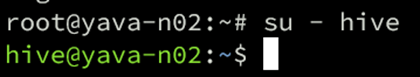

2. Masuk ke shell hbase

    ```
    # hbase shell
    ```

    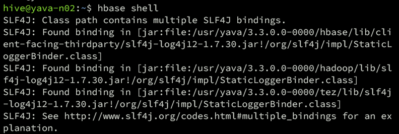

## HBase Query

1. Membuat tabel
   
   Perintah “create” digunakan untuk membuat tabel, pada saat pembuatan tabel harus ditentukan nama tabel dan nama kolom family.
   sintaks dasar:

   ```
   # create ‘<table name>’,’<column family>’
   ```

   Contoh membuat tabel:

   ```
   # create 'customers_ian', 'personalData', 'professionalData'
   ```

   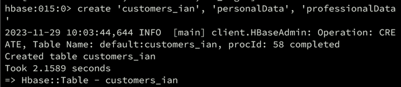

2. Listing tabel
   
   Listing tabel digunakan untuk menapilkan tabel yang tersedia di HBase. Berikut adalah contoh perintahnya:

   ```
   # list
   ```

   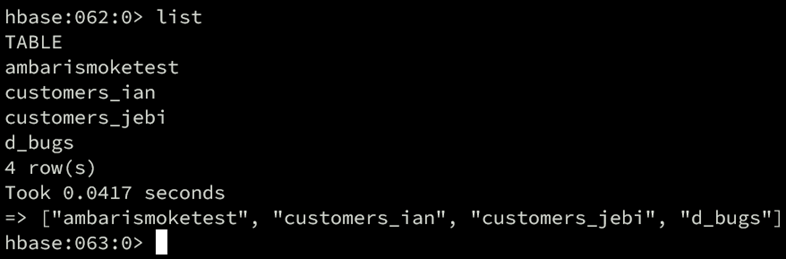

3. Disable tabel
   
   Perintah disable table digunakan ketika sebuah tabel akan dihapus. Ketika sebuah tabel telah di-disable maka perintah lain untuk mengakses tabel tersebut tidak bisa digunakan. Berikut contoh perintah dasarnya:

   ```
   # disable ‘nama tabel’
   ```

   Contoh disable sebuah tabel:

   ```
   # disable ‘customers_test’
   ```

   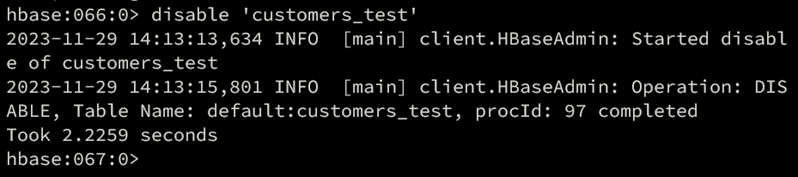

4. Enable tabel
   
   Perintah enable table digunakan untuk mengaktifkan kembali tabel yang sebelumnya di-disable.
   Sintaks dasar:

   ```
   # enable ‘nama tabel’
   ```

   Contoh penggunaan:

   ```
   # enable ‘customers_test’
   ```

   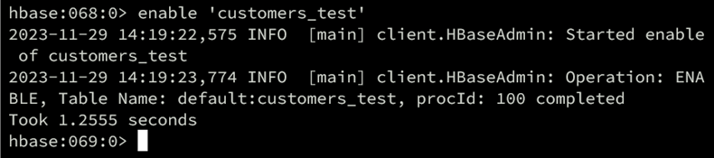

5. Describe dan Alter
   
   Perintah describe digunakan untuk menampilkan deskripsi dari sebuah tabel. Contoh sintaks:

   ```
   # describe ‘customers_test’
   ```

   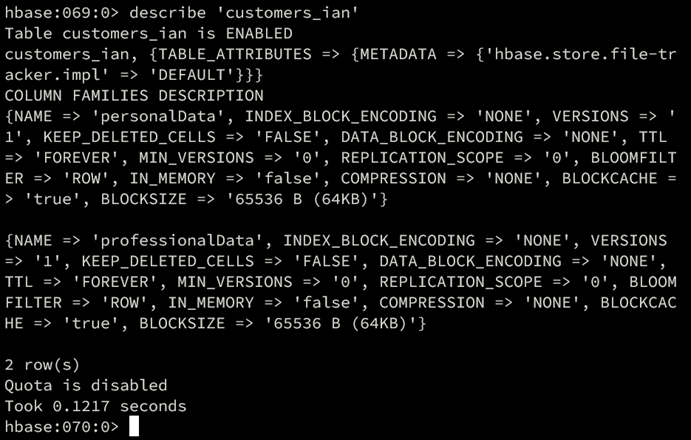

   Perintah alter digunakan untuk melakukan perubahan tabel yang sudah ada. Perubahan tersebut meliputi mengubah jumlah maksimum sel dari kelompok kolom, mengatur dan menghapus operator cakupan tabel, dan menghapus kelompok kolom dari tabel.
   - Mengganti jumlah maksimum sel dari sebuah kolom family:

     ```
     alter 'customers_test', {NAME => 'personalData', VERSIONS => 5}
     ```

     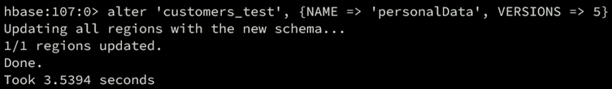

   - Table Scope Operators
    Digunakan untuk mengatur dan menghapus table scope operators diantaranya adalah:

      1. **MAX_FILESIZE**: Menentukan ukuran maksimum dari setiap file HFile di suatu region sebelum region tersebut dipecah menjadi dua region terpisah.
      2. **READONLY**: Parameter ini digunakan untuk menjadikan sebuah tabel HBase hanya dapat dibaca (read-only) dan tidak dapat dimodifikasi.
      3. **MEMSTORE_FLUSHSIZE**: Menentukan ukuran maksimum dari memstore sebelum data disimpan ke disk sebagai file HFile.
      4. **DEFERRED_LOG_FLUSH**: Jika diatur, akan mengizinkan penundaan proses log flush untuk meningkatkan kinerja.

        Contoh mengatur setting Read Only:

        ```
        # alter ‘<nama table>’, READONLY
        ```

        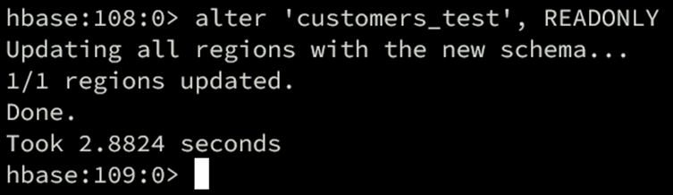

    - Deleting Column Family
        Berikut adalah contoh cara menghapus kolom family:

        ```
        # alter 'cutomers_test', 'DELETE', 'personalData'
        ```

        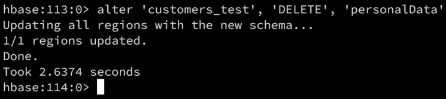

6. Exists
   
   Perintah “exists” digunakan untuk mengetahui keberadaan sebuah tabel. Berikut adalah contoh penggunaannya:

   ```
    # exists ‘<nama tabel>’
    ````

    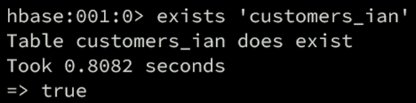
    Hasil dari perintah di atas akan mengembalikan “true” jika tabel tersedia dan akan mengembalikan “false” jika sebaliknya.

7. Scan
   
   Perintah scan digunakan untuk melihat data, berikut adalah contoh perintahnya:

   ```
   # scan ‘<nama table>’
   ```

   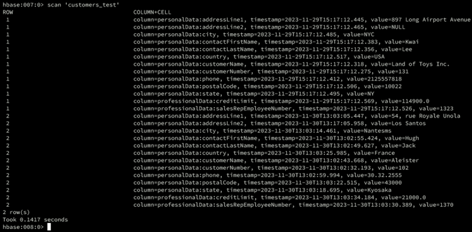
8. Drop tabel
   
   Untuk menggunakan perintah drop terlebih dahulu harus men-disable tabel yang akan di-drop, berikut adalah contoh perintahnya:

   ```
   # disable ‘emp’
   
   # drop ‘emp’
   ```

   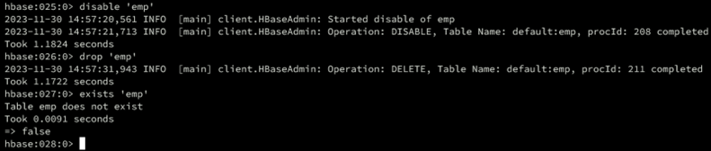

   Selain menggunakan drop dapat menggunakan perintah drop_all dengan regex, berikut contoh penggunaannya:

   ```
   # drop_all 'c.*'
   ```

9.  Create data
    
    Berikut adalah perintah untuk membuat data di table HBase:

    Sintaks dasar:

    ```
    # put ’<table name>’,’row1’,’<colfamily:colname>’,’<value>’
    ```

    Contoh:

    ```
    # put ‘customers_test’,’1’,’personalData:customerNumber’,’131’
    ```

    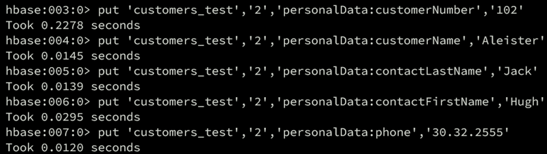

10. Update data
    
    Untuk memperbarui data di sel gunakan perintah put seperti contoh di bawah:
    
    Sintaks dasar:
    ```
    # put ‘table name’,’row ’,'Column family:column name',’new value’
    ```
    
    Contoh mengubah value di row 2 berikut:
    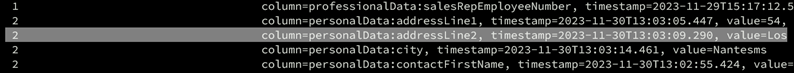


    ```
    # put ‘customers_test’,’2’,’personalData:addressLine2’,’Los Santos’
    ```
    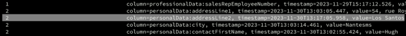

    Nilai pada addressLine2 telah berubah.

11. Read data
    
    Untuk membaca data gunakan perintah get. Berikut sintaks dasarnya:
    ```
    # get ‘<table name>’,’row1’
    ```
    Contoh menggunakan perintah get:
    ```
    # get ’customers_test’,’1’
    ```

    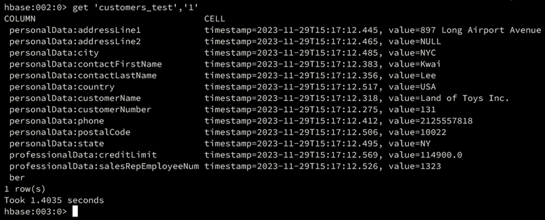

    Berikut adalah contoh untuk membaca data kolom secara spesifik:
    Sintaks dasar:
    ```
    # get 'table_name', 'row_key', 'column_family:column_qualifier'
    ```
    Contoh penggunaan:
    ```
    # get 'customers_test', '1', 'personalData:customerName'
    ```

    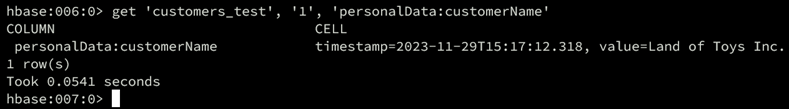

12. Hapus data
    
    Untuk menghapus sel secara spesifik dapat menggunakan perintah delete, berikut sintaks dasarnya:
    ```
    # delete ‘<table name>’, ‘<row>’, ‘<column name >’
    ```
    Untuk menghapus semua sel di table gunakan perintah berikut:
    ```
    # deleteall ‘<table name>’, ‘<row>’
    ```
    Contoh penggunaan:
    ```
    # delete 'customers_test', '1', 'personalData:customerName'
    ```
    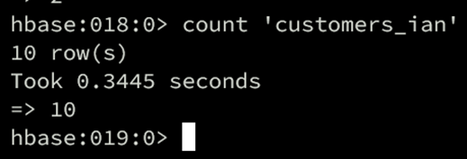

13. Count and truncate
    
    Untuk menghitung jumlah baris gunakan perintah count berikut:
    ```
    # count <nama tabel>
    ```
    
    Perintah truncate digunakan untuk membuat ulang sebuah tabel, berikut adalah contoh sintaksnya:
    ```
    # truncate <nama tabel>
    ```
    
    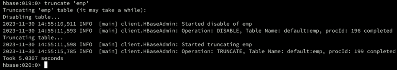
