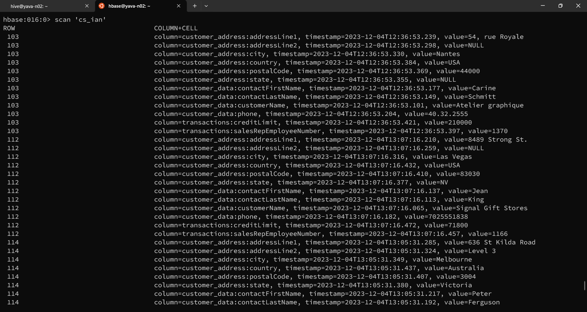

# Memasukkan data ke table HBase

Buat table untuk menampung data yang akan dimasukkan dengan perintah berikut:

```
# create 'cs_ian', 'customer_data', 'customer_address', 'transactions'
```

Masukkan data dengan perintah `put`:
```
# put 'cs_ian','103','customer_data:customerName','Atelier graphique'
# put 'cs_ian','103','customer_data:contactLastName','Schmitt'
# put 'cs_ian','103','customer_data:contactFirstName','Carine'
# put 'cs_ian','103','customer_data:phone','40.32.2555'

# put 'cs_ian','103','customer_address:addressLine1','54, rue Royale'
# put 'cs_ian','103','customer_address:addressLine2','NULL'
# put 'cs_ian','103','customer_address:city','Nantes'
# put 'cs_ian','103','customer_address:state','NULL'
# put 'cs_ian','103','customer_address:postalCode','440000'
# put 'cs_ian','103','customer_address:country','France'
 
# put 'cs_ian','103','transactions:salesRepEmployeeNumber','1370'
# put 'cs_ian','103','transactions:creditLimit','210000'
```

