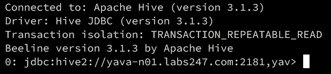
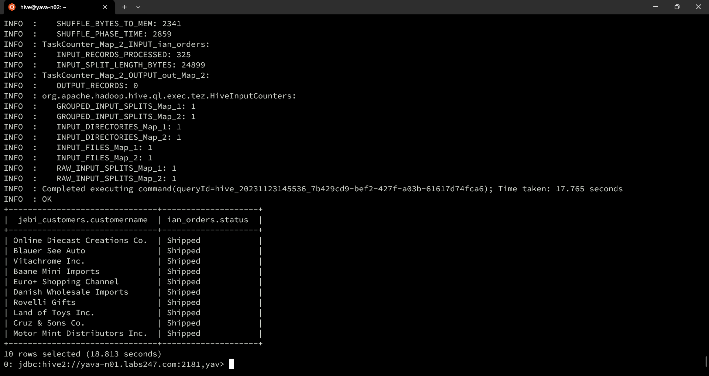
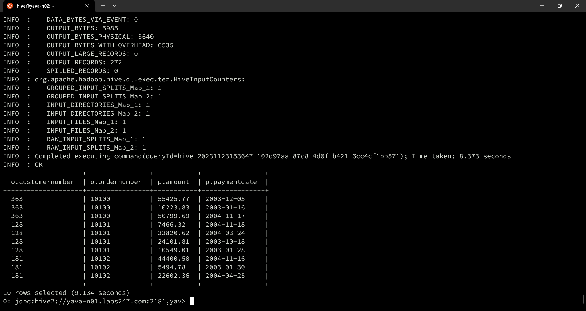
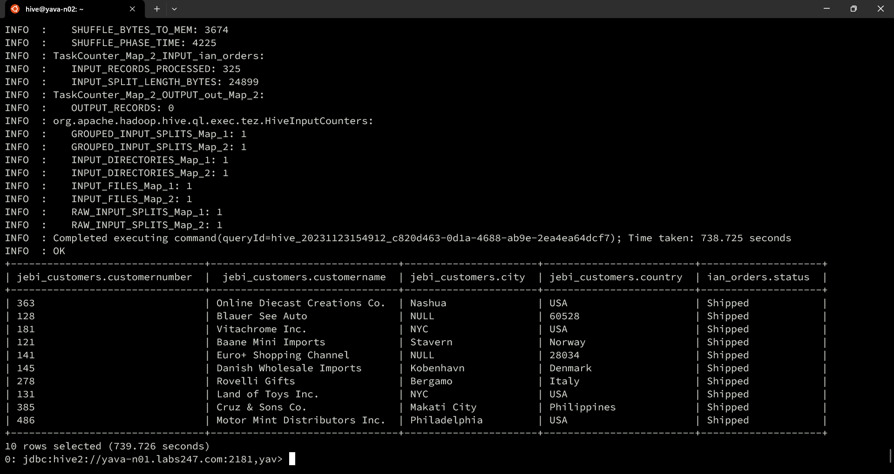
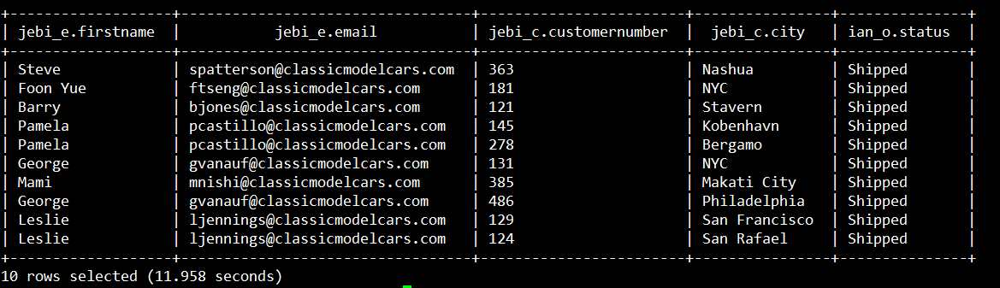

# Hive Guide

Apache Hive adalah proyek open source yang dijalankan oleh relawan di Apache Software Foundation. Hive merupakan suatu infrastruktur datawarehousing untuk Hadoop. Fungsi utama dari Hive adalah untuk menyediakan data summarization, query dan analisis. Hive juga mendukung analisis dataset berukuran besar yang tersimpan di HDFS Hadoop dan juga pada filesystem Amazon S3. Hive mendukung perintah yang mirip dengan SQL seperti akses ke data terstruktur yang dikenal dengan istilah Hive-QL (atau HQL) serta analisis data yang besar dengan bantuan MapReduce. Hive tidak dibangun untuk mendapatkan respon cepat terhadap query namun dibuat terutama untuk aplikasi data mining. Aplikasi data mining dapat memakan waktu beberapa menit hingga beberapa jam untuk menganalisis data dan Hive terutama digunakan di sana.

1. Switch user ke Hive:

   ```
   su - hive
   ```

   
2. Buat file data.txt untuk testing:

   ```
    1201	Gopal	45000	Technical manager
    1202	Manisha	45000	Proof reader
    1203	Masthanvali	40000	Technical writer
    1204	Kiran	40000	Hr Admin
    1205	Kranthi	30000	Op Admin
   ```

3. Menghubungkan ke Hive menggunakan Beeline:

   ```
   beeline -n hive -p hive
   ```

   
   
4. Masukkan data ke HDFS dengan perintah:

   ```
   hdfs dfs -put data.txt /tmp/ian/learn1/
   ```

5. Buat table di HIVE dengan perintah:

   ```
    CREATE EXTERNAL TABLE IF NOT EXISTS employee (   eid int, name String,
    salary String, destination String)
    COMMENT 'Employee details'
    ROW FORMAT DELIMITED
    FIELDS TERMINATED BY '\t'
    LINES TERMINATED BY '\n'
    STORED AS TEXTFILE;
    ```

6. Load data tersebut dengan perintah:

   ```
   LOAD DATA INPATH '/tmp/ian/learn1/data2.txt' INTO TABLE employee;
   ```

7. Menampilkan data di table dengan perintah:

   ```
   select * from employee;
   ```

   

# Hive Query

## Built-in Operators

1. Relational Operators
   
   Menampilkan pembayaran pada tahun tertentu:

   ```
   select * from payments where year(paymentdate)=2004 limit 10
   ```

   

   Menampilkan jumlah amount lebih dari 7000:

   ```
   select * from payments where payments.amount>7000 limit 10;
   ```

   

2. Arithmetic Operators
   Menjumlahkan dua angka:

   ```
   SELECT 20+30 ADD FROM payments;
   ```

   

3. Logical Operators
   Menampilkan data amount > 4000 pada tahun 2004:

   ```
   SELECT * FROM payments WHERE amount>40000 AND year(paymentdate)=2004 limit 10;
   ```

   

## Built-in Functions

1. round() function
   ```
   SELECT
   checknumber,
   ROUND(amount) AS rounded_amount
   FROM payments
   WHERE checknumber = 'HQ336336';
   ```

   
   
2. floor() function
   ```
   SELECT
   checknumber,
   FLOOR(amount) AS floored_amount
   FROM payments
   WHERE checknumber = 'HQ336336';

   ```

   

3. ceil() function
   ```
   SELECT
   checknumber,
   CEIL(amount) AS ceiled_amount
   FROM payments
   WHERE checknumber = 'HQ336336';
   ```
   

## Select Where

Menampilkan payment untuk customer tertentu:
```
select * from payments where payments.customernumber=114;
```


## Select Order-by

Mengambil semua data dengan customernumber 114 dan mengurutkannya berdasarkan paymentdate dan amount:
```
SELECT *
FROM payments
WHERE customernumber = 114
ORDER BY paymentdate DESC, amount DESC;
```


## Select group by

Data diurutkan dan dihitung berdasarkan customernumber. Fungsi agregasi COUNT digunakan untuk menghitung total pembayaran untuk setiap customernumber, sementara SUM digunakan untuk menghitung total jumlah pembayaran.
```
SELECT
customernumber,
COUNT(*) AS total_payments,
SUM(amount) AS total_amount
FROM payments
GROUP BY customernumber
LIMIT 10;
```


# Query Join Hive antar tabel dan DB

JOIN digunakan untuk menggabungkan data dari dua atau lebih tabel berdasarkan suatu kondisi tertentu. JOIN adalah salah satu fitur utama dalam query Hive untuk menggabungkan data dari berbagai tabel berdasarkan kolom atau kondisi tertentu. Berikut ini adalah contoh Studi kasus untuk penggunaan join pada Hive menggunakan database yang sama maupun database yang berbeda:

## Join 2 tabel

1. Mengetahui nama customer dan status order

```
SELECT
jebi_customers.customerName,
ian_orders.status
FROM jebi.customers as jebi_customers 
JOIN ian.orders as ian_orders 
ON jebi_customers.customerNumber = ian_orders.customerNumber LIMIT 10;
```



2. Mengetahui informasi jumlah order dari customer:

```
SELECT c.customerName, o.orderNumber, o.shippedDate, o.status, p.amount, p.paymentDate
FROM orders o JOIN payments p ON o.customerNumber = p.customerNumber
JOIN customers c ON c.customerNumber = p.customerNumber LIMIT 10;
```

SELECT o.orderNumber, o.shippedDate, o.status, p.amount, p.paymentDate
FROM orders o JOIN payments p 
ON (o.customerNumber = p.customerNumber) LIMIT 10;


3. Mengetahui informasi stok barang:

```
SELECT
 p.quantityInStock,
 p.productLine,
 p.productName,
 pr.textDescription
FROM products p
JOIN productlines pr 
ON p.productLine = pr.productLine
LIMIT 10;
```


4. Mengetahui informasi dari customer:

```
SELECT 
 o.customerNumber,
 o.orderNumber,
 p.amount,
 p.paymentDate
FROM orders o
JOIN payments p 
ON o.customerNumber = p.customerNumber
LIMIT 10;
```



```
SELECT
jebi_customers.customerNumber,
jebi_customers.customerName,
jebi_customers.city,
jebi_customers.country,
ian_orders.status
FROM jebi.customers as jebi_customers 
JOIN ian.orders as ian_orders 
ON jebi_customers.customerNumber = ian_orders.customerNumber LIMIT 10;
```



## JOIN 3 tabel

1. Mengetahui informasi dari employee:

```
SELECT
jebi_e.firstName,
jebi_e.email,
jebi_c.customerNumber,
jebi_c.city,
ian_o.status
FROM jebi.employees AS jebi_e
JOIN jebi.customers AS jebi_c ON jebi_e.employeeNumber = jebi_c.salesRepEmployeeNumber
JOIN ian.orders AS ian_o ON jebi_c.customerNumber = ian_o.customerNumber
LIMIT 10;
```


