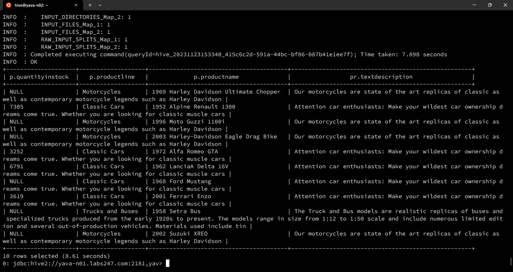

# Query Join Hive antar tabel dan DB

JOIN digunakan untuk menggabungkan data dari dua atau lebih tabel berdasarkan suatu kondisi tertentu. JOIN adalah salah satu fitur utama dalam query Hive untuk menggabungkan data dari berbagai tabel berdasarkan kolom atau kondisi tertentu. Berikut ini adalah contoh Studi kasus untuk penggunaan join pada Hive menggunakan database yang sama maupun database yang berbeda:

## Join 2 tabel

1. Mengetahui nama customer dan status order
```
SELECT
jebi_customers.customerName,
ian_orders.status
FROM jebi.customers as jebi_customers 
JOIN ian.orders as ian_orders 
ON jebi_customers.customerNumber = ian_orders.customerNumber LIMIT 10;
```


2. Mengetahui informasi jumlah order dari customer:
```
SELECT c.customerName, o.orderNumber, o.shippedDate, o.status, p.amount, p.paymentDate
FROM orders o JOIN payments p ON o.customerNumber = p.customerNumber
JOIN customers c ON c.customerNumber = p.customerNumber LIMIT 10;
```

SELECT o.orderNumber, o.shippedDate, o.status, p.amount, p.paymentDate
FROM orders o JOIN payments p 
ON (o.customerNumber = p.customerNumber) LIMIT 10;


3. Mengetahui informasi stok barang:
```
SELECT
 p.quantityInStock,
 p.productLine,
 p.productName,
 pr.textDescription
FROM products p
JOIN productlines pr 
ON p.productLine = pr.productLine
LIMIT 10;
```



4. Mengetahui informasi dari customer:
```
SELECT 
 o.customerNumber,
 o.orderNumber,
 p.amount,
 p.paymentDate
FROM orders o
JOIN payments p 
ON o.customerNumber = p.customerNumber
LIMIT 10;
```


```
SELECT
jebi_customers.customerNumber,
jebi_customers.customerName,
jebi_customers.city,
jebi_customers.country,
ian_orders.status
FROM jebi.customers as jebi_customers 
JOIN ian.orders as ian_orders 
ON jebi_customers.customerNumber = ian_orders.customerNumber LIMIT 10;
```


## JOIN 3 tabel

1. Mengetahui informasi dari employee:
```
SELECT
jebi_e.firstName,
jebi_e.email,
jebi_c.customerNumber,
jebi_c.city,
ian_o.status
FROM jebi.employees AS jebi_e
JOIN jebi.customers AS jebi_c ON jebi_e.employeeNumber = jebi_c.salesRepEmployeeNumber
JOIN ian.orders AS ian_o ON jebi_c.customerNumber = ian_o.customerNumber
LIMIT 10;
```

