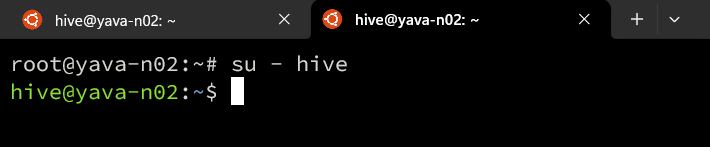
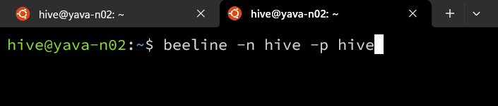
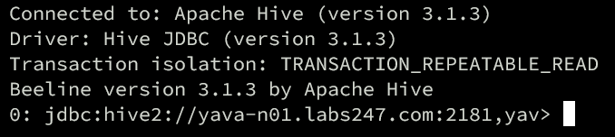
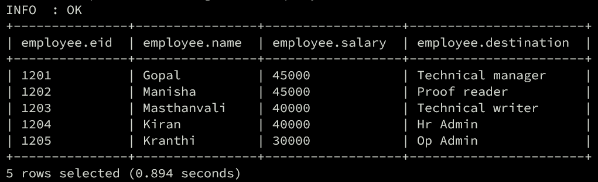

# Learn Hive Syntax

1. Switch user ke Hive:
   ```
   su - hive
   ```
   
2. Buat file data.txt untuk testing:
   ```
   1201	Gopal	45000	Technical manager
    1202	Manisha	45000	Proof reader
    1203	Masthanvali	40000	Technical writer
    1204	Kiran	40000	Hr Admin
    1205	Kranthi	30000	Op Admin
   ```
3. Menghubungkan ke Hive menggunakan Beeline:
   ```
   beeline -n hive -p hive
   ```
   
   
4. Masukkan data ke HDFS dengan perintah:
   ```
   hdfs dfs -put data.txt /tmp/ian/learn1/
   ```
5. Buat table di HIVE dengan perintah:
   ```
    CREATE EXTERNAL TABLE IF NOT EXISTS employee (   eid int, name String,
    salary String, destination String)
    COMMENT 'Employee details'
    ROW FORMAT DELIMITED
    FIELDS TERMINATED BY '\t'
    LINES TERMINATED BY '\n'
    STORED AS TEXTFILE;
    ```
6. Load data tersebut dengan perintah:
   ```
   LOAD DATA INPATH '/tmp/ian/learn1/data2.txt' INTO TABLE employee;
   ```
7. Menampilkan data di table dengan perintah:
   ```
   select * from employee;
   ```
   

