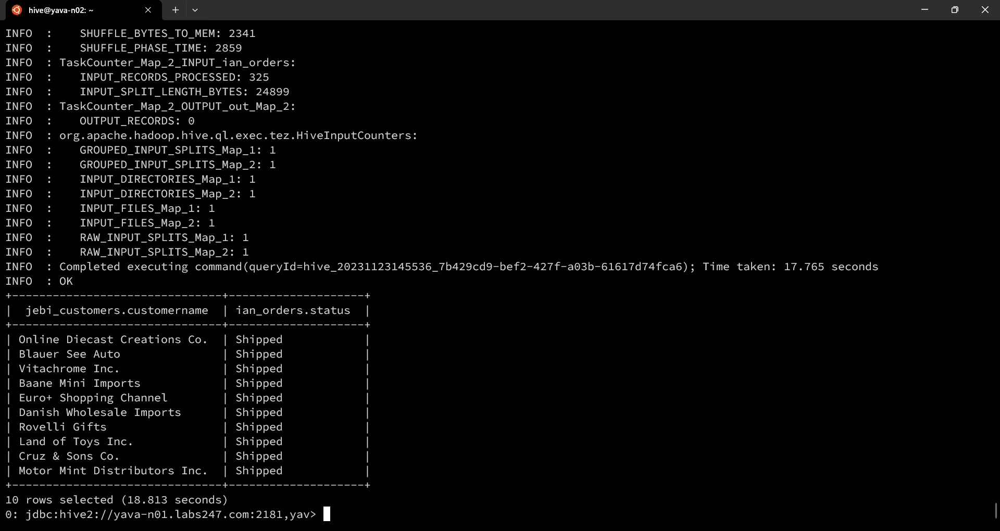
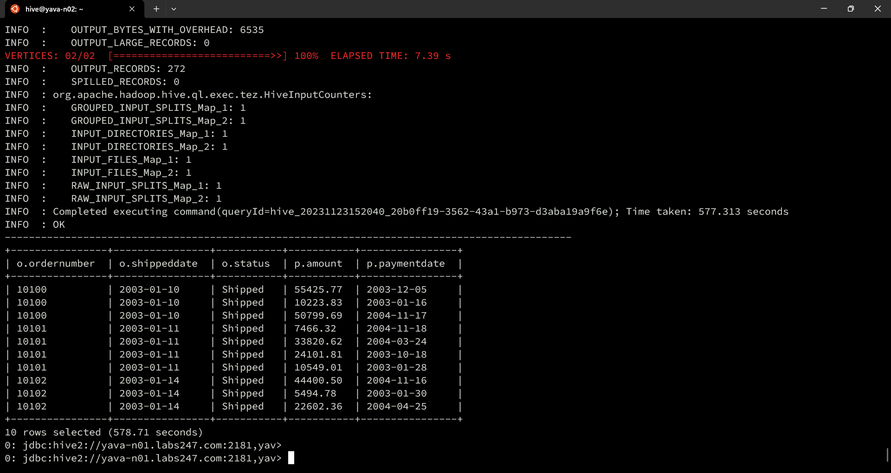
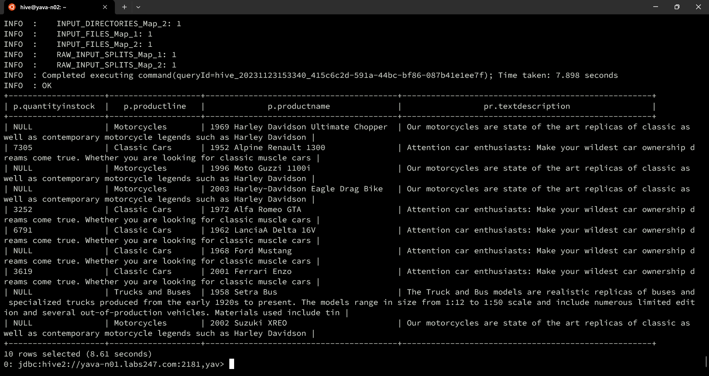
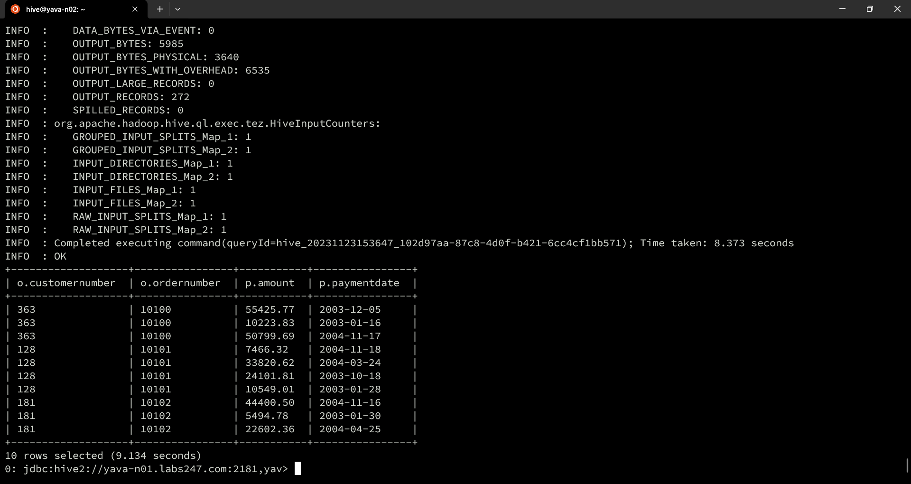
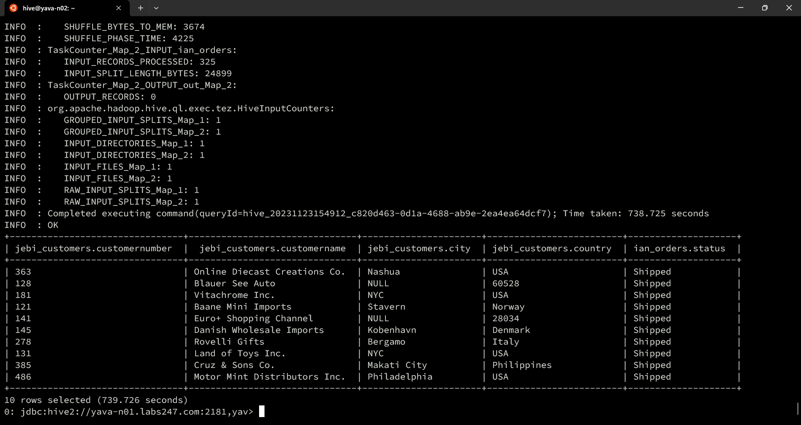
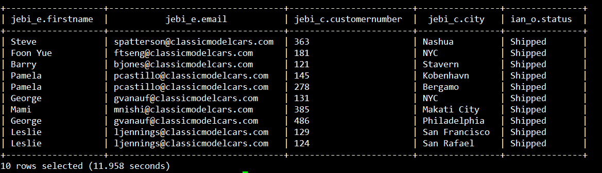

# Query Join Hive antar tabel dan DB

## Join 2 tabel

1.
```
SELECT
jebi_customers.customerName,
ian_orders.status
FROM jebi.customers as jebi_customers 
JOIN ian.orders as ian_orders 
ON jebi_customers.customerNumber = ian_orders.customerNumber LIMIT 10;
```



2. 
```
SELECT c.customerName, o.orderNumber, o.shippedDate, o.status, p.amount, p.paymentDate
FROM orders o JOIN payments p ON o.customerNumber = p.customerNumber
JOIN customers c ON c.customerNumber = p.customerNumber LIMIT 10;
```


3.
```
SELECT
 p.quantityInStock,
 p.productLine,
 p.productName,
 pr.textDescription
FROM products p
JOIN productlines pr 
ON p.productLine = pr.productLine
LIMIT 10;
```



4..
```
SELECT 
 o.customerNumber,
 o.orderNumber,
 p.amount,
 p.paymentDate
FROM orders o
JOIN payments p 
ON o.customerNumber = p.customerNumber
LIMIT 10;
```


5..
```
SELECT
jebi_customers.customerNumber,
jebi_customers.customerName,
jebi_customers.city,
jebi_customers.country,
ian_orders.status
FROM jebi.customers as jebi_customers 
JOIN ian.orders as ian_orders 
ON jebi_customers.customerNumber = ian_orders.customerNumber LIMIT 10;
```


## JOIN 3 tabel

6.
```
SELECT
jebi_e.firstName,
jebi_e.email,
jebi_c.customerNumber,
jebi_c.city,
ian_o.status
FROM jebi.employees AS jebi_e
JOIN jebi.customers AS jebi_c ON jebi_e.employeeNumber = jebi_c.salesRepEmployeeNumber
JOIN ian.orders AS ian_o ON jebi_c.customerNumber = ian_o.customerNumber
LIMIT 10;
```

