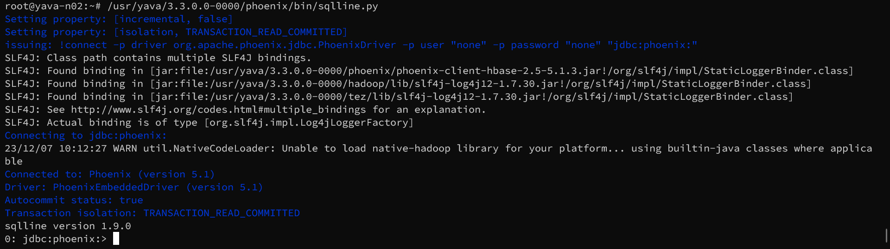

# Apache Phoenix Guide

Untuk masuk ke lingkungan Phoenix / start Phoenix CLI gunakan perintah berikut:

```
/usr/yava/3.3.0.0-0000/phoenix/bin/sqlline.py
```




# Mengakses data HBase dari Phoenix

Untuk membaca data Hbase menggunakan phoenix terlebih dahulu harus membuat `view` sesuai data di HBase karena phoenix tidak auto sinkron metadata dari HBase. Berikut contohnya:

Ini adalah table bernama "cs_ian" di HBase:


1. Mengecek table yang tersedia di Phoenix:

    Gunakan perintah berikut untuk menampilkan semua table di Phoenix:

    ```
    !tables
    ```

    

2. Selanjutnya membuat `view` di phoenix berdasarkan table target di HBase:

    ```
    CREATE VIEW "cs_ian" ( ROWKEY VARCHAR PRIMARY KEY, "customer_data"."customerName" VARCHAR, "customer_data"."contactLastName" VARCHAR, "customer_data"."contactFirstName" VARCHAR, "customer_data"."phone" VARCHAR, "customer_address"."addressLine1" VARCHAR, "customer_address"."addressLine2" VARCHAR, "customer_address"."city" VARCHAR, "customer_address"."state" VARCHAR, "customer_address"."postalCode" VARCHAR, "customer_address"."country" VARCHAR, "transactions"."salesRepEmployeeNumber" VARCHAR, "transactions"."creditLimit" VARCHAR ) ;
    ```

    

    Untuk menampilkan data di table "cs_ian" gunakan perintah berikut:

    ```
    SELECT * FROM "cs_ian";
    ```
    > Karena Phoenix case-sensitive maka gunakan tanda petik pada nama table

    
