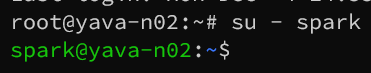
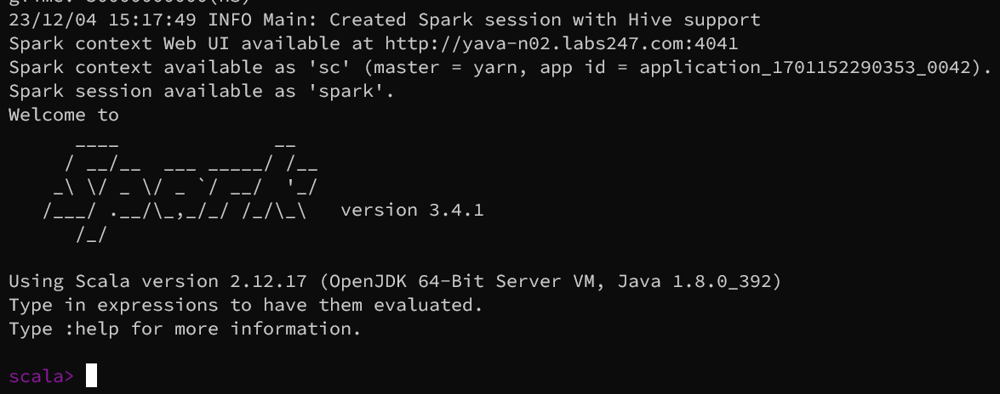
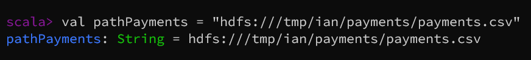
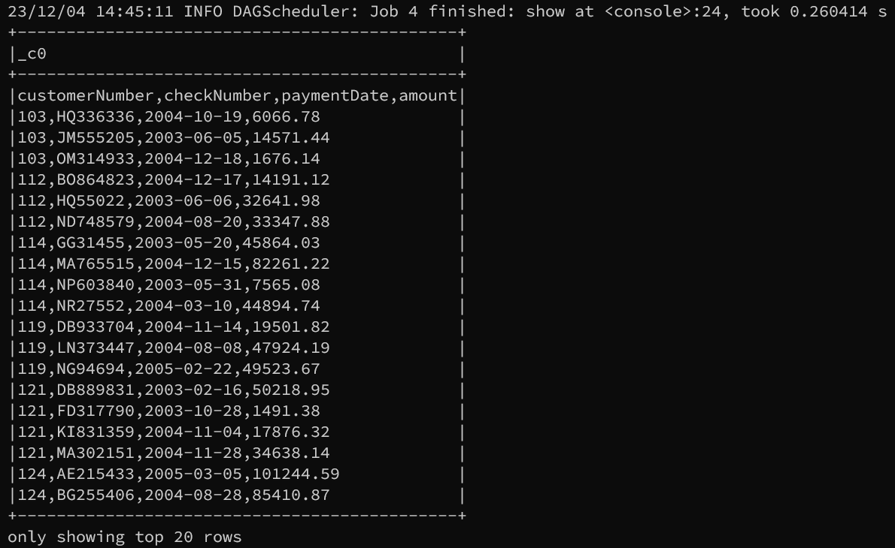
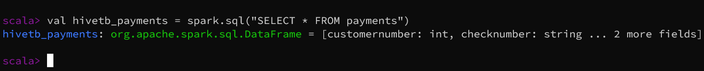
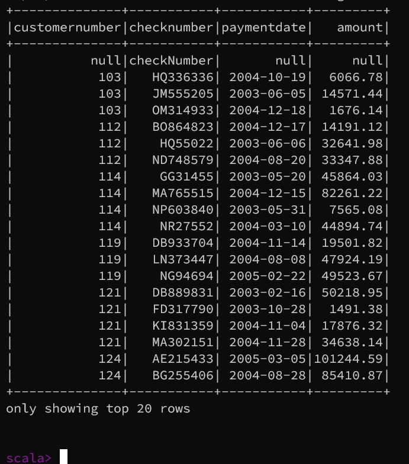
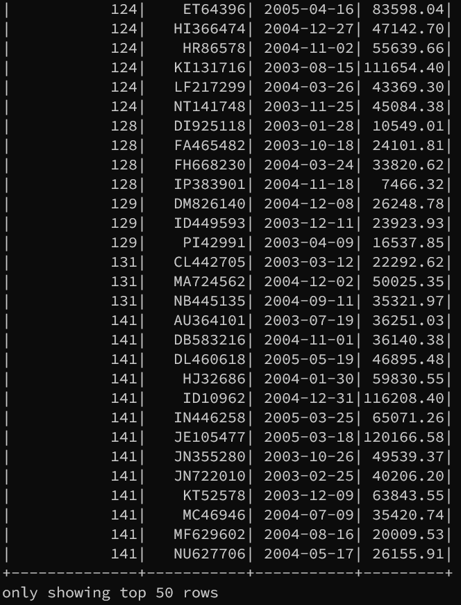

# Apache Spark Guide

## Introduction

Apache Spark merupakan teknologi komputasi cluster yang cepat, yang dirancang untuk perhitungan cepat.
Hal ini didasarkan pada Hadoop MapReduce dan memperluas model dari MapReduce untuk efisiensi lebih banyak
jenis perhitungan, yang mencakup query interaktif dan stream processing. Fitur utama Apache Spark adalah
komputasi cluster di memory yang meningkatkan kecepatan pemrosesan aplikasi. Apache Spark dirancang untuk
mencakup berbagai macam beban kerja seperti batch aplication, iterative algorithms, interactive queres dan
streaming.

## Akses Spark CLI menggunakan spark-shell

1.  Masuk dengan user spark

    ```
    su - spark
    ```

    

2.  Akses spark-shell dengan `scala` menggunakan perintah berikut:

    ```
    spark-shell
    ```

    

## Spark Basic Query

1. Load dan membaca data CSV dari HDFS:
   Berikut ini adalah contoh untuk membaca data CSV dari HDFS `payments`:

   ```
   // variabel untuk menyimpan data CSV dari path HDFS

   val pathPayments = "hdfs:///tmp/ian/payments/payments.csv"
   ```

   

   ```
   // variabel untuk menyimpan hasil read data CSV ke data frame
   
   val df = spark.read.csv(pathPayments)

   /// menampilkan data frame dengan opsi hanya menampilkan 20 baris dan memuat semua kolom pada data tersebut

   df.show(20, false)
   ```

   


## Spark SQL access to hive table

Berikut ini adalah contoh untuk membaca data di Hive menggunakan Spark SQL:

1. Membuat variabel untuk menampung query:

   ```
   val hivetb_payments = spark.sql("SELECT * FROM payments")
   ```

   

2. Menampilkan data:

   ```
   hivetb_payments.show()
   ```

   
   > Jika tidak diatur isi parameter di fungsi `show()` maka akan ditampilkan 20 data teratas.

3. Menampilkan data dengan jumlah tertentu:

   ```
   hivetb_payments.show(50)
   ```

   
   > menampilkan 50 data teratas