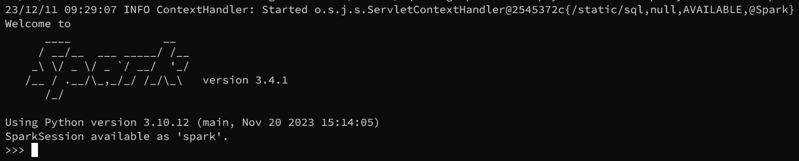
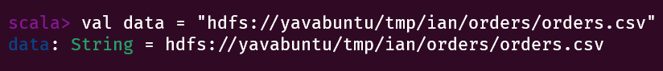
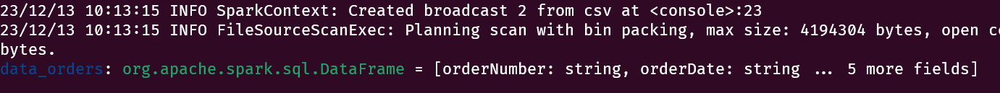
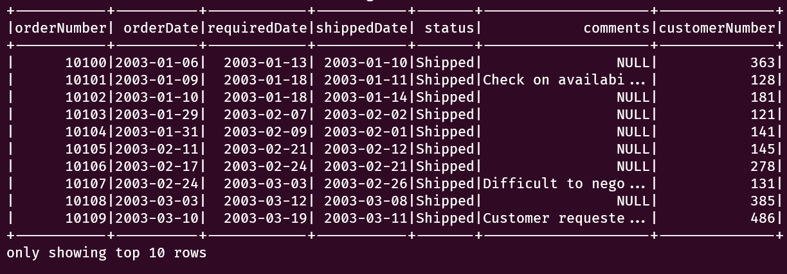
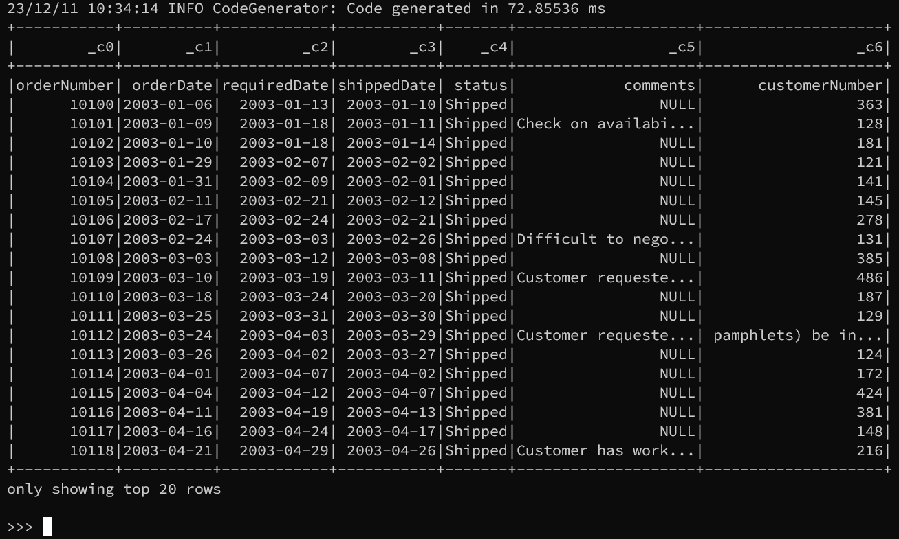
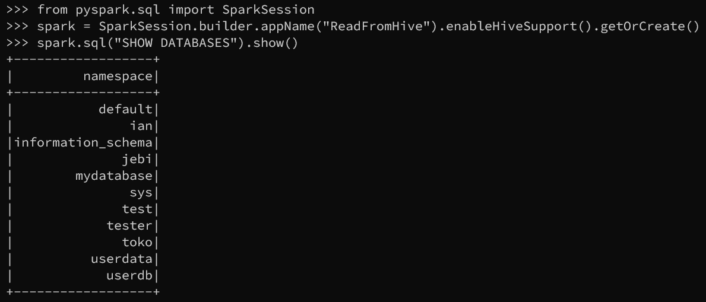
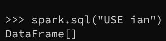
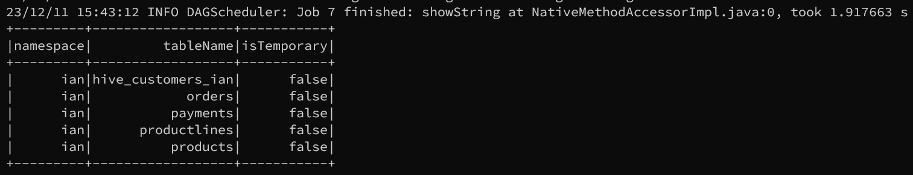
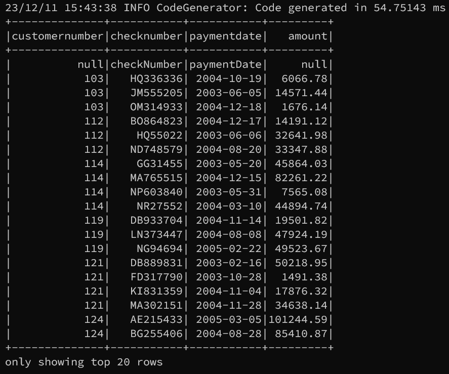

# Apache Spark Guide

## Introduction

Apache Spark merupakan teknologi komputasi cluster yang cepat, yang dirancang untuk perhitungan cepat.
Hal ini didasarkan pada Hadoop MapReduce dan memperluas model dari MapReduce untuk efisiensi lebih banyak
jenis perhitungan, yang mencakup query interaktif dan stream processing. Fitur utama Apache Spark adalah
komputasi cluster di memory yang meningkatkan kecepatan pemrosesan aplikasi. Apache Spark dirancang untuk
mencakup berbagai macam beban kerja seperti batch aplication, iterative algorithms, interactive queres dan
streaming.

## Akses Spark CLI menggunakan spark-shell

`spark-shell` adalah shell interaktif untuk Apache Spark yang mendukung bahasa Scala.

1.  Masuk dengan user spark

    ```
    su - spark
    ```

    

2.  Akses spark-shell menggunakan perintah berikut:

    ```
    spark-shell
    ```

    

## Akses Spark menggunakan pyspark

`pyspark` memungkinkan pengguna untuk berinteraksi dengan Spark menggunakan bahasa pemrograman Python. Berikut adalah perintah untuk masuk ke spark shell:

```
pyspark
```



## Spark Basic Query

### Membaca data CSV dari HDFS dengan spark-shell:

1. Load dan membaca data CSV dari HDFS:
   
   Berikut ini adalah contoh untuk membaca data CSV dari HDFS `payments`:

   ```
   // variabel untuk menyimpan data CSV dari path HDFS

   val data = "hdfs://yavabuntu/tmp/ian/orders/orders.csv"
   ```

   

   ```
   // Menggunakan delimiter untuk filter data

   val data_orders = spark.read.option("delimiter", ",").option("header", "true").csv(data)
   ```

   

   ```

   /// menampilkan data dengan fungsi `show()` dan menampilkan 10 baris teratas

   data_orders.show(10)
   ```

   

### Membaca data CSV dari HDFS dengan pyspark:

1. Load dan baca data CSV dari HDFS:
   
   ```
   orders = "hdfs:////tmp/ian/orders/orders.csv"
   ```

2. Masukkan data tersebut ke data frame:
   
   ```
   df = spark.read.csv(orders)
   ```

3. Tampilkan data frame:
   
   ```
   df.show()
   ```

   


## Spark SQL access to Hive table using spark-shell

Berikut ini adalah contoh untuk membaca data di Hive menggunakan Spark SQL:

1. Membuat variabel untuk menampung query:

   ```
   val hivetb_payments = spark.sql("SELECT * FROM payments")
   ```

   

2. Menampilkan data:

   ```
   hivetb_payments.show()
   ```

   
   > Jika tidak diatur isi parameter di fungsi `show()` maka akan ditampilkan 20 data teratas.

3. Menampilkan data dengan jumlah tertentu:

   ```
   hivetb_payments.show(50)
   ```

   
   > menampilkan 50 data teratas

## Spark read database and table on Hive using pyspark

Berikut ini adalah langkah-langkah untuk membaca database dan table di Hive menggunakan pyspark

import library python:

```
from pyspark.sql import SparkSession
```

Buat spark session dengan Hive support:

```
spark = SparkSession.builder.appName("ReadFromHive").enableHiveSupport().getOrCreate()
```

tampilkan list database menggunakan query sql:

```
spark.sql("SHOW DATABASES").show()
```



Memilih database:

```
spark.sql("USE <nama table>")
```



Menampilkan list table di database yang telah dipilih:

```
spark.sql("SHOW TABLES").show()
```



Menampilkan data di table tertentu:

```
spark.sql("SELECT * FROM payments").show()
```

