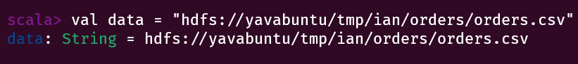
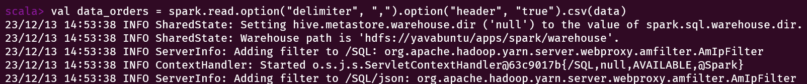
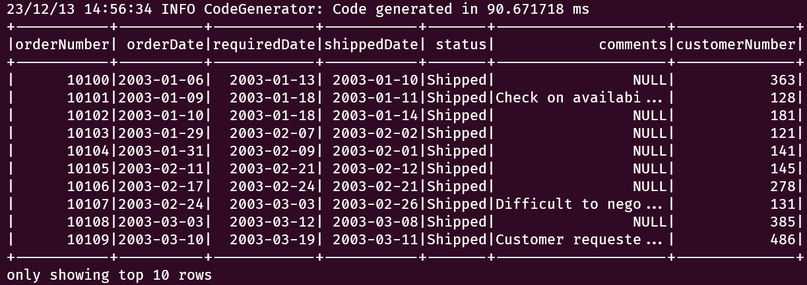
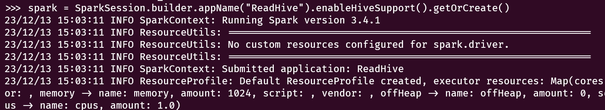
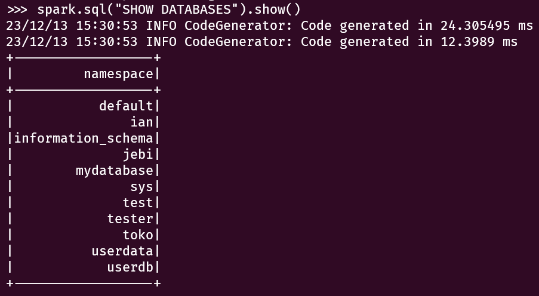
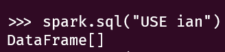
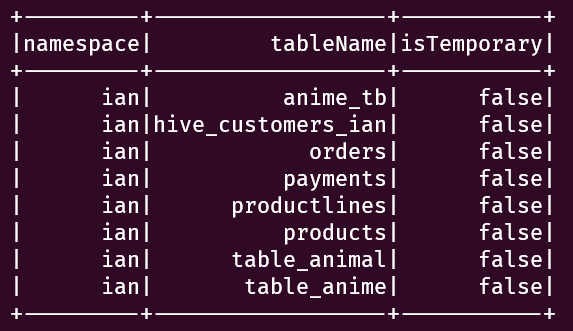
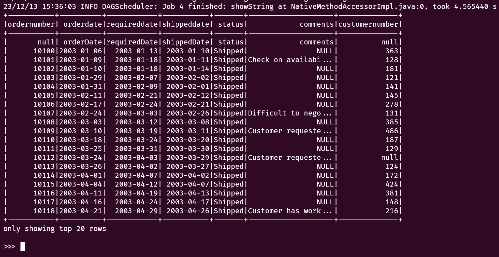

# Testing Spark

## Read data csv via spark-shell

Berikut adalah cara untuk membaca file CSV dari `spark-shell` :

1. Tentukan variabel untuk menyimpan path CSV:
   
   ```
    val data = "hdfs://yavabuntu/tmp/ian/orders/orders.csv"
    ```

    

2. Atur delimiter untuk menampilkan data CSV:

    ```
    val data_orders = spark.read.option("delimiter", ",").option("header", "true").csv(data)
    ```

    

3. Tampilkan data sebanyak 10 baris:

    ```
    data_orders.show(10)
    ```

    

## Spark read database and table on hive using pyspark

Berikut ini adalah cara membaca database dan table Hive melalui `pyspark`:

```
from pyspark.sql import SparkSession

// tentukan spark session
spark = SparkSession.builder.appName("ReadHive").enableHiveSupport().getOrCreate()
```



```
// tampilkan list database

spark.sql("SHOW DATABASES").show()
```



```
// pilih database

spark.sql("USE <nama_database>")
```



```
// tampilkan list table

spark.sql("SHOW TABLES").show()
```



```
// tampilkan data di table

spark.sql("SELECT * FROM <nama_table>").show()
```

