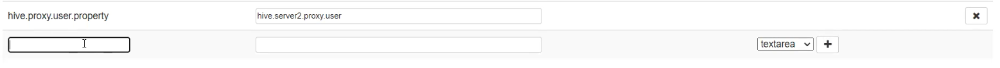
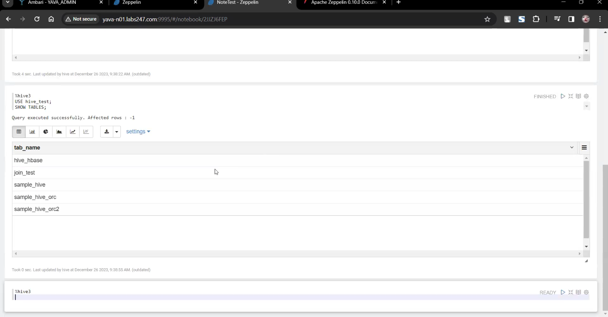

# Buat User Zeppelin

Buat user menggunakan `shiro` untuk user `hive` :

1. Di Ambari pada service Zeppelin pilih `Advanced zeppelin-shiro-ini`
2. Define nama user dan password menggunakan shiro menggunakan perintah:
   
   ```
   java -jar shiro-tools-hasher-1.3.2-cli.jar -p

   ```

    Masukkan password

   
   
3. Masukkan nama user dan password yang telah digenerate oleh shiro pada tabel `shiro_ini_content` diikuti dengan nama role:
   
   

4. Pada bagian role tambahkan username baru:
   
   

5. Cek konfigurasi `zeppelin.interpreter.config.upgrade`
   
   

   Pastikan value `false`

6. Save dan restart Zeppelin.

# Create Note di Zeppelin

Buat note di Zeppelin UI:


Pilih interpreter SH dan jalankan commad `whoami` :


>Interpreter berhasil dijalankan

# Create Interpreter

1. Buat interpreter `hive3` dan interpreter group ke `jdbc`:

    

2. Atur konfigurasi properties:
   
   default.url:

   ```
   jdbc:hive2://yava-n01.labs247.com:2181,yava-n02.labs247.com:2181,yava-n03.labs247.com:2181/;serviceDiscoveryMode=zooKeeper;zooKeeperNamespace=hiveserver2
   ```

   default.user dan default.password: hive

   default.driver:

   ```
   org.apache.hive.jdbc.HiveDriver
   ```

   Masukkan `hive.proxy.user.property`:

   

3. Pada dependencies masukkan artifact berikut:
   
    ```
    /usr/yava/3.3.0.0-0000/hive/lib/hive-jdbc-3.1.3.jar   
    /usr/yava/3.3.0.0-0000/hadoop/hadoop-common-3.3.6.jar   
    /usr/yava/3.3.0.0-0000/hive/lib/hive-exec-3.1.3.jar   
    /usr/yava/3.3.0.0-0000/hive/lib/httpcore-4.4.13.jar   
    /usr/yava/3.3.0.0-0000/hive/lib/hive-service-3.1.3.jar   
    /usr/yava/3.3.0.0-0000/hive/lib/curator-client-4.2.0.jar   
    /usr/yava/3.3.0.0-0000/hive/lib/curator-framework-4.2.0.jar   
    /usr/yava/3.3.0.0-0000/zookeeper/zookeeper-3.7.1.jar   
    /usr/yava/3.3.0.0-0000/hive/lib/jline-2.12.jar   
    /usr/yava/3.3.0.0-0000/zookeeper/zookeeper-jute-3.7.1.jar
   ```

   

4. Jalankan command hive di Zeppelin Notebook:



