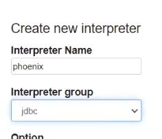
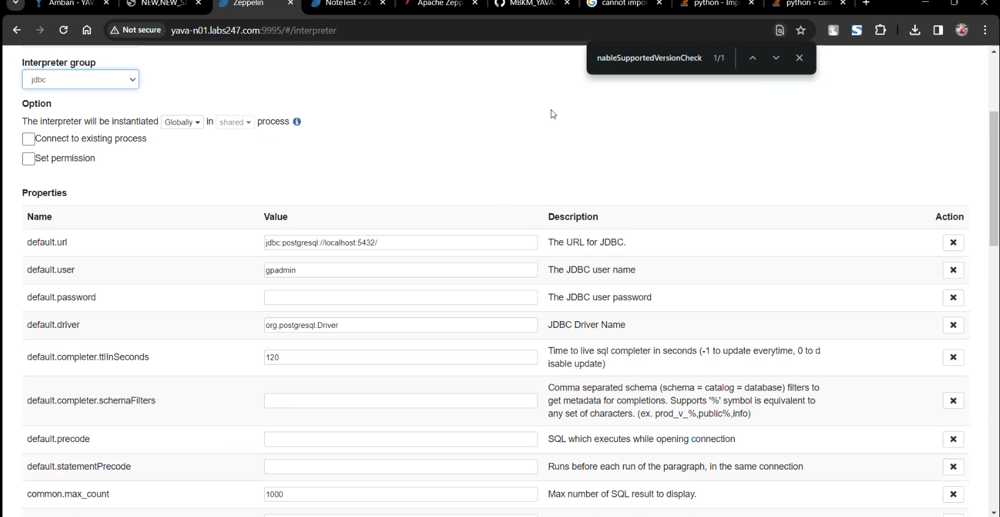
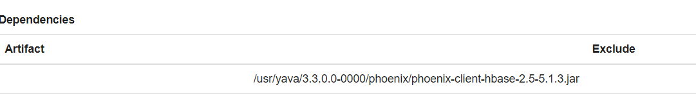
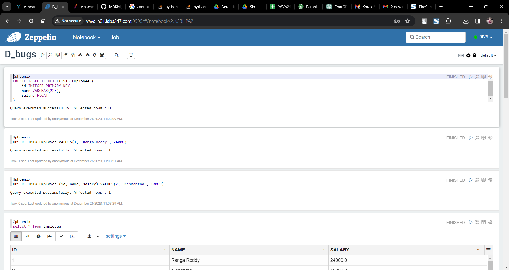

# Konfigurasi Interpreter Spark

## Konfigurasi
Buat interpreter baru dengan nama `phoneix` dan atur group ke `jdbc`:



## Konfigurasi Properties

default.url:

```
jdbc:phoenix:yava-n01.labs247.com,yava-n02.labs247.com,yava-n03.labs247.com:/hbase-unsecure
```

default.driver:

```
org.apache.phoenix.jdbc.PhoenixDriver
```



## Dependencies artifact

Atur artifact sebagai berikut:

```
/usr/yava/3.3.0.0-0000/phoenix/phoenix-client-hbase-2.5-5.1.3.jar
```



## Jalankan command phoenix:

