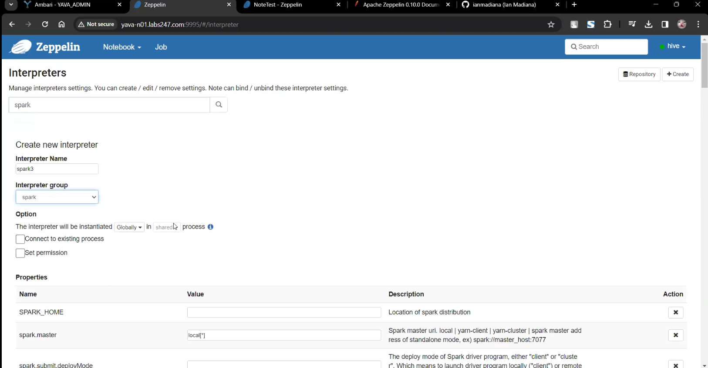
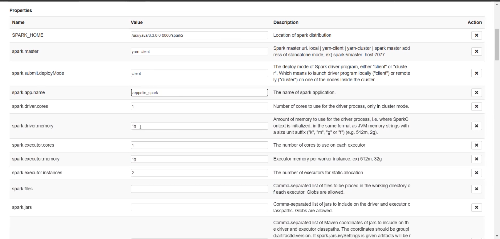
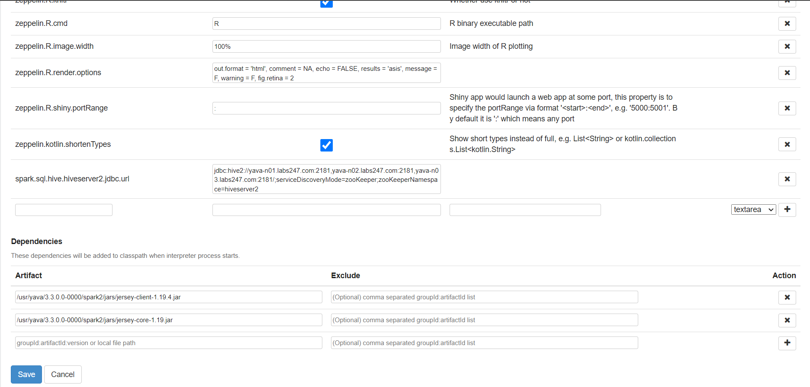
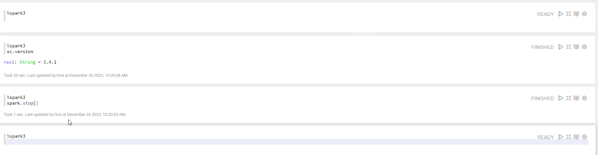

# Konfigurasi Interpreter Spark

Buat interpreter baru:


>nama interpreter: spark3 - 
>Interpreter group: spark

Atur properties

SPARK_HOME: 
```
/usr/yava/3.3.0.0-0000/spark2
```
spark.master:


```
yarn
```

spark.submit.deployMode:

```
client
```

spark.app.name:
```
zeppelin_spark
```

PYSPARK_PYTHON:

```
/usr/bin/python3
```

PYSPARK_DRIVER_PYTHON

```
/usr/bin/python3
```

zeppelin.spark.enableSupportedVersionCheck:

```
false
```



spark.sql.hive.hiveserver2.jdbc.url:

```
jdbc:hive2://yava-n01.labs247.com:2181,yava-n02.labs247.com:2181,yava-n03.labs247.com:2181/;serviceDiscoveryMode=zooKeeper;zooKeeperNamespace=hiveserver2
```

Masukkan artifact:

```
/usr/yava/3.3.0.0-0000/spark2/jars/jersey-client-1.19.4.jar   
/usr/yava/3.3.0.0-0000/spark2/jars/jersey-core-1.19.jar

```



Save.

## jalankan command spark di Zeppelin Notebook

